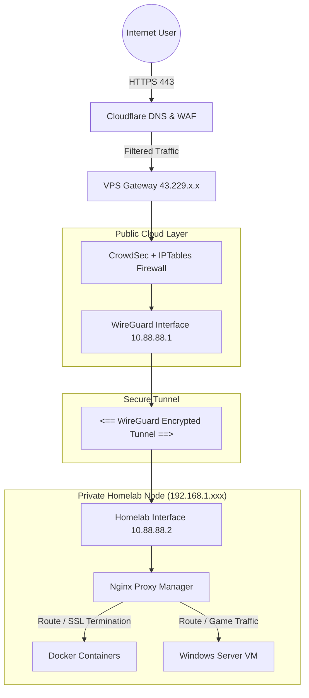

# GorevYoneticisi: Enterprise Homelab Infrastructure


**A fully self-hosted, high-availability hybrid cloud architecture designed to bypass Carrier-Grade NAT (CGNAT) and deliver secure services via a VPS ingress gateway.**

---

## 📖 Table of Contents
1. [Architecture Overview](#-architecture-overview)
2. [Hardware & System Specifications](#-hardware--system-specifications)
3. [Network Topology & Traffic Flow](#-network-topology--traffic-flow)
4. [Security Implementation](#-security-implementation-defense-in-depth)
5. [Service Catalog](#-service-catalog)
6. [Virtualization (KVM/Libvirt)](#-virtualization-kvmlibvirt)
7. [Storage & Backup Strategy](#-storage--backup-strategy)
8. [Maintenance & Automation](#-maintenance--automation)

---

## 🏗 Architecture Overview

This infrastructure simulates a production environment by solving a critical networking constraint: **hosting public services from a residential connection behind CGNAT**. 

It utilizes a **Public VPS** as a transparent reverse proxy and firewall sentry. Traffic is accepted at the public cloud edge and tunneled securely to the local hardware via **WireGuard**.

* **Gateway:** VPS (Portmind IP: `43.229.x.x`) acts as the public ingress point.
* **Tunnel:** WireGuard Site-to-Site (`10.88.88.x`) establishes a persistent, encrypted link between the cloud VPS and the home server.
* **Host:** Local Lenovo Tiny PC running Ubuntu Server + Docker, serving as the compute and storage node.
* **Management:** Access is secured via Cloudflare Zero Trust for authentication and Tailscale for out-of-band management.

---

## 🖥 Hardware & System Specifications

The system is optimized for high-performance computing within a compact thermal envelope, utilizing a tiered storage architecture.

| Component | Specification | Usage Notes |
| :--- | :--- | :--- |
| **Host Model** | Lenovo ThinkCentre M710q "Tiny" | Ultra-Small Form Factor |
| **CPU** | Intel Core i3-6300 @ 3.80GHz | 2 Cores / 4 Threads |
| **RAM** | 12 GB DDR4 | 11Gi Usable (High availability reserved for VM operations) |
| **OS** | Ubuntu 24.04.3 LTS | Kernel `6.8.0-88-generic` |
| **Primary Disk** | 500GB SATA SSD (`sda`) | **OS Boot**, LVM Root, Docker Overlay |
| **Fast Storage** | 256GB NVMe (`nvme0n1`) | **VM Storage**, Fast I/O Containers |
| **Bulk Storage** | 3x500GB SATA HDD (`sdb, sdc, sdd`) | **Media**, Cold Storage (NTFS Formatted) |
| **Power** | ~2.2W Idle / 15W Load | Highly efficient for 24/7 operation |

---

## 💾 Storage & Backup Strategy

The storage is architected into three distinct tiers for performance and capacity management.

### Storage Layout
* **Tier 1 (OS/System):** `/dev/mapper/ubuntu--vg-ubuntu--lv` (EXT4) on **SATA SSD**.
    * *Hosts:* Linux OS, Docker Images, System Configs.
* **Tier 2 (Performance):** `/mnt/nvme256_nvme0n1p1` (EXT4) on **NVMe**.
    * *Hosts:* KVM Virtual Machine Disks (QCOW2), High-I/O Application Data.
* **Tier 3 (Capacity):** `/mnt/sdd2` (NTFS) on **HDD**.
    * *Hosts:* Media Libraries (Movies/Music), Archives.

### Backup Strategy
* **Tool:** Duplicati
* **Schedule:** Daily @ 04:00 AM
* **Target:** Google Drive (2TB) - AES-256 Encrypted
* **Retention:** Smart Retention Policy (7 Days / 4 Weeks / 12 Months)

#### Backup Manifest (Source Mapping)
The backup container is mapped to the host root (`/`) via `/source`.

* ✅ `/source/etc` (System Configs, Firewall Rules, WireGuard Keys, Fstab)
* ✅ `/source/DATA/AppData` (Docker Container Configs, Databases)
* ✅ `/source/home/taskmanager` (User Scripts, Shell History)
* ✅ `/source/mnt/sdd2/music` (FLAC Media Library)

*Exclusions: `/var/lib/docker` (Volatile data), `/var/lib/libvirt/images` (VM Disks - backed up separately via snapshot).*

---

## 🌐 Network Topology & Traffic Flow

### Traffic Flow Diagram
*GitHub will render this code block as a visual flowchart.*



---

Gateway Configuration (VPS)
The VPS accepts traffic on public ports and rewrites the destination to the Homelab's internal tunnel IP (10.88.88.2).

Ingress Firewall: Configured to block ALL incoming ports except for Cloudflare IP ranges (for Web traffic) and specific Game Ports.

SSH Security: The SSH daemon is bound strictly to the Tailscale Interface (100.x.x.x). Port 22 is completely closed to the public internet, preventing brute-force attacks.

Forwarding: iptables NAT rules handle the traffic forwarding through the WireGuard tunnel.

Port Forwarding Map:

TCP 80/443 → Nginx Proxy Manager (Web Ingress)

UDP 30814 → BeamMP Server

UDP/TCP 30988 → Assetto Corsa Server

---

## 🛡 Security Implementation (Defense in Depth)

We utilize a **Six-Layer Security Model** to ensure zero unauthorized access and robust defense against threats.

1.  **Perimeter (Cloudflare Zero Trust):** Implements an "Admin Lockdown" policy. Access to sensitive subdomains (`dashboard`, `portainer`, `backup`) requires Email OTP authentication.
2.  **Edge (Cloudflare WAF):** Provides DDoS protection, Geo-blocking for high-risk regions, and Bot Management.
3.  **Gateway (CrowdSec on VPS):** Analyzes logs in real-time. Malicious IPs engaging in scanning or brute-force attempts are banned at the VPS firewall level *before* they can reach the tunnel.
4.  **Transport (WireGuard):** Ensures end-to-end encryption for all traffic passing through the tunnel.
5.  **Host Hardening:**
    * **SSH:** Password authentication is **DISABLED**. Access is only possible via SSH Keys.
    * **Kernel:** `sysctl` settings are hardened to prevent IP spoofing and redirect attacks.
    * **Auditing:** `auditd` is enabled for detailed system call logging.
6.  **Integrity & Malware:**
    * **ClamAV:** Runs daily filesystem scans to detect malicious files.
    * **Rkhunter:** Performs daily checks for rootkits and system anomalies.

---

## 📦 Service Catalog

All services are containerized via Docker (managed by CasaOS) and proxied via Nginx Proxy Manager with Let's Encrypt SSL.

### 🟢 Public / User Services
| Service | URL | Port | Description |
| :--- | :--- | :--- | :--- |
| **Homepage** | `gorevyoneticisi.xyz` | `3067` | Central command dashboard for monitoring services. |
| **Navidrome** | `music...` | `4533` | FLAC Music Streaming server. |
| **WordPress** | `wp...` | `8084` | Web Hosting (MySQL 5.7 Backend). |
| **Assetto Corsa** | `join...` | `30988` | Racing Server hosted via KVM (301 Redirect to CM). |
| **BeamMP** | `beamng...` | `30814` | BeamNG Drive Multiplayer Server. |
| **Uptime Kuma** | `status...` | `3001` | Public Status Monitoring page. |
| **Dashdot** | `dash...` | `3066` | Live System Resource Monitor. |

### 🔒 Admin / Restricted Services
*Protected by Cloudflare Zero Trust Email Authentication*

* **Proxy Manager:** `dashboard...` (Port 81) - SSL/Route Management
* **Portainer:** `portainer...` (Port 9000) - Container Orchestration
* **Backup Mgr:** `backup...` (Port 8200) - Backup Management
* **PDF Tools:** `pdf...` (Port 8087) - Stirling PDF Tools

---

## 💻 Virtualization (KVM/Libvirt)

A persistent **Windows Server 2016** instance runs on KVM/Libvirt to host game server binaries that require the Windows architecture.

* **VM Name:** `win2016` (ID: 3)
* **State:** Running
* **Storage:** `/mnt/nvme256_nvme0n1p1/vms/win2016.qcow2` (Resized +50GB)
* **Autostart:** Enabled (`virsh autostart win2016`) ensures the VM boots automatically with the host.
* **Mount Stability:** Drives are mounted via UUID in `/etc/fstab` to ensure ISO and Disk paths remain stable across reboots.

---

## 💾 Storage & Backup Strategy

* **Tool:** Duplicati
* **Schedule:** Daily @ 04:00 AM
* **Target:** Google Drive (2TB) - AES-256 Encrypted
* **Retention:** Smart Retention Policy (7 Days / 4 Weeks / 12 Months)

### Backup Manifest (Source Mapping)
The backup container is mapped to the host root (`/`) via `/source` to ensure full system recovery capability, including system configs and user data.

* ✅ `/source/etc` (System Configs, Firewall Rules, WireGuard Keys, Fstab)
* ✅ `/source/DATA/AppData` (Docker Container Configs, Databases, Volumes)
* ✅ `/source/home/taskmanager` (User Scripts, Shell History)
* ✅ `/source/var/lib/casaos` (Dashboard Layout & Settings)
* ✅ `/source/var/lib/tailscale` (VPN Identity State)
* ✅ `/source/mnt/sdd2/music` (FLAC Media Library)

*Exclusions: `/var/lib/docker` (Volatile data), `/var/lib/libvirt/images` (VM Disks - too large).*

---

## 🔧 Maintenance & Automation

* **OS Updates:** `unattended-upgrades` is enabled to automatically apply critical security patches to the host OS.
* **App Updates:** `containrrr/watchtower` container checks for new Docker images and seamlessly restarts containers every 24 hours.
* **Docker Engine:** The Docker package is locked via `apt-mark hold` to prevent API incompatibility issues with CasaOS.
* **Firewall Persistence:** `netfilter-persistent` is configured to save and restore IPtables NAT rules across reboots.

### Installed Utilities
The environment is equipped with a comprehensive custom toolset for diagnostics and management:
`ncdu`, `neofetch`, `htop`, `wireguard`, `tailscale`, `ufw`, `fail2ban`, `crowdsec`, `git`, `nano`.

### Disaster Recovery Commands
If the server is rebooted, verify status with the following commands:

```bash
# Check VPN Tunnel Handshake
sudo wg show

# Check VM Status
sudo virsh list --all

# Check Docker Containers
docker ps --format "table {{.Names}}\t{{.Status}}"

# Check Firewall NAT Rules
sudo iptables -t nat -S
```

---
**Maintainer:** TaskManager
**Documentation Generated:** December 2025

*Disclaimer: System architecture, configuration, and engineering implementation are original work. This documentation file was polished by AI for formatting and clarity.*
